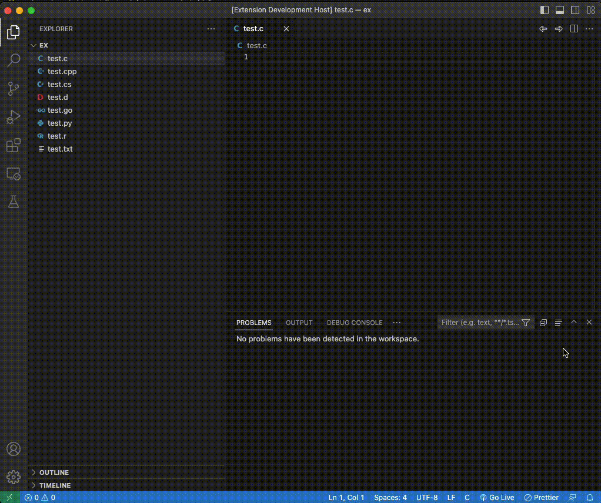

# FileNavigator

This simple extension helps to navigate forwards and back between recently opened files easily.

## Features

Use the two arrow button in the top right side of the workspace for navigation.

## How it works

The same can be done using keyboard shortcuts:

| Command      | Keybindings (Windows) | Keybindings (Mac)  | Keybindings (Linux) |
| ------------ | --------------------- | ------------------ | ------------------- |
| `Go back`    | `Ctrl + Shift + ←`    | `Ctrl + Shift + ←` | `Ctrl + Shift + ←`  |
| `Go forward` | `Ctrl + Shift + ←`    | `Ctrl + Shift + ←` | `Ctrl + Shift + ←`  |

## Known Issues

Ability to navigate inside a file and using hotkeys will be include in 2.0.

## Release Notes

### 1.0.1

- Extension with navigation buttons

### 1.0.2

- Added keybindings.

---

**Enjoy!**
